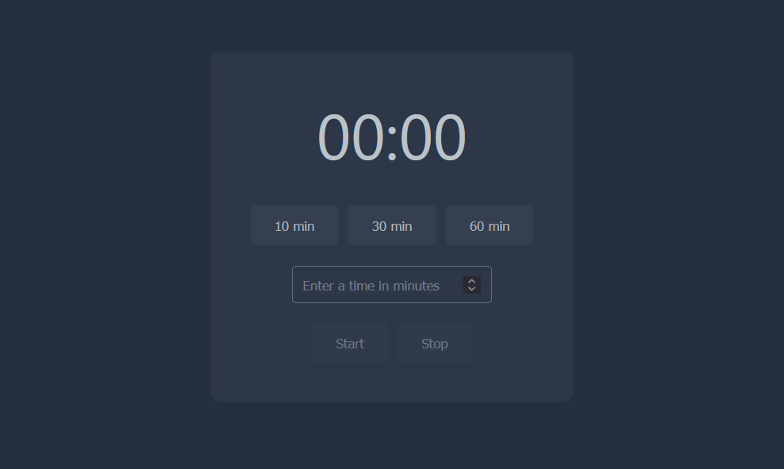

# Timer Extension

A Chrome extension for managing countdown timers with a clean, modern interface.

## Features

- Preset timers (10, 30, 60 minutes)
- Custom timer input (1 min - 24 hrs)
- Desktop notifications
- Timer persists across sessions
- Badge shows remaining time
- Toggle 1-minute warning notifications on/off

## Installation

1. Open `chrome://extensions/`
2. Enable "Developer mode"
3. Click "Load unpacked" and select the extension folder

## Usage

1. Click extension icon in toolbar
2. Select preset or enter custom time
3. Click "Start"

## Technical Stack

- JavaScript, HTML, CSS
- Chrome Extension Manifest V3
- Chrome APIs: storage, notifications, alarms, contextMenus

## Files

- `popup.html` - Timer interface
- `popup.js` - Timer logic
- `background.js` - Service worker
- `styles.css` - Styling
- `manifest.json` - Configuration
